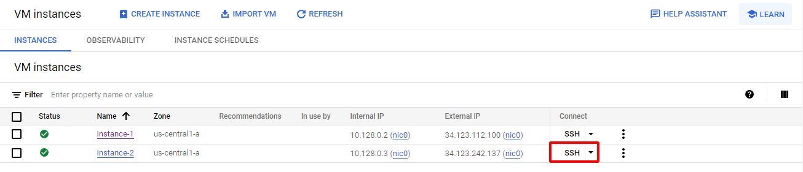

# [Python + Google Cloud Platform (Google Cloud Storage, Bigquery, Cloud Function, Compute Engine)] VNStock Daily Data

## Introduction

**Bài toán** : Tôi muốn có dữ liệu về thị trường chứng khoán Việt Nam để có thể dựa vào số liệu đưa ra quyết định trong việc mua bán các mã cổ phiếu

**Yêu cầu**: 

1. Snapshot toàn bộ dữ liệu chứng khoán trong lịch sử tới thời điểm hiện tại và lưu vào trong GCS và ghi vào Bigquery.
2. Dữ liệu daily sẽ được cập nhật vào mỗi 16h hằng ngày. Pipeline là lưu vào GCS & Import vào Bigquery. Tự động hoá pipeline.

## How to use

**Step 1 : Clone my project**

`git clone https://github.com/thangnh1/Vnstock-Data-GCP`

**Step 2 : Open in editor tool, run command in terminal**

`pip install -r requirements.txt`

**Step 3 : Run file `get_data.py`**

`python get_data.py`

After running file `get_data.py`, file `data.csv` contains all stock data from past to present time

**Step 4 : Load data to GCS and Bigquery**

At Google Console, create new project, activate APIs Service : Bigquery, Cloud Storage, Compute Engine, Cloud Function.

  
  
  
   

Then search `IAM & Admin`. In IAM & Admin NavMenu, choose Service Accounts

 

   
  <i>NavMenu IAM & Admin</i>

Click `CREATE SERVICE ACCOUNT` and fill info

 

   
  <i>Create service account &</i>  
    
    
   
  <i>Fill Infomatiton account</i>  

Now, your service account is created!

 

   
  <i>List Service Account & Detail</i>

Select the newly created account, switch to the `Keys` > `Add key` > `Create new key`

 

   
  <i>Create key</i>

Choose `JSON Type` and Create, a JSON file containing your credentials will be downloaded to the local server

 

    
    
   
  <i>JSON file key</i>

Back to Editor, open `push_data.py`, edit variable value, then run command `python push_data.py`  
Check result in GCS and Bigquery in Google Console.

**Step 5 : Create trigger with Cloud Function**

Open Cloud Function, choose `CREATE FUNCTION`

 

   
  <i>Create function</i>

Config function to run every time new data is added to GCS

 

   
  <i>Config function</i>

Config memory, timeout and choose service account 

 

   
  <i>Config function</i>

Switch Runtime to `Python 3.x` 

Entry point and Function need to have the same name

`main.py` is the file containing the function code, copy the contents of the file `cloud_function.py` from local and paste it into `main.py`

Add `goole.cloud` and `google.cloud.bigquery` to `requirements.txt`

 

   

**Step 6 : Create VM with Compute Engine**

Open Compute Engine, at VM instance choose `CREATE INSTANCE`

 

    
   

Config arbitrarily according to use needs, then click CREATE

 

    
   

After the virtual machine is created, select SSH at the Connect tab to open SSH-in-browser

 

    
   

**Step 7 : Update data daily**

In SSH-in-browser, run command 

`sudo timedatectl set-timezone Asia/Ho_Chi_Minh`

Copy file `update_data.py` and `requirements.txt` from local to VM with `scp` or `Upload File` in SSH-in-browser

Setup pip3 : `sudo apt upgrade & sudo apt-get install python-pip3`

Install libs : `pip3 install -r requirements.txt`

Create script : `touch auto_run.sh & nano auto_run.sh`
add the following line to the opened file `python3 update_data.py`. Exit & save with `Ctrl + X` -> `y` -> `Enter`

Config Cronjob : 
`crontab -e`
add the following line to the opened file `0 16 * * * bash /home/<user_name>/auto_run.sh`. Exit & save with `Ctrl + X` -> `y` -> `Enter`

## Demo

 

   
  <i>Bigquery</i>

 

   
  <i>Log active trigger</i>

